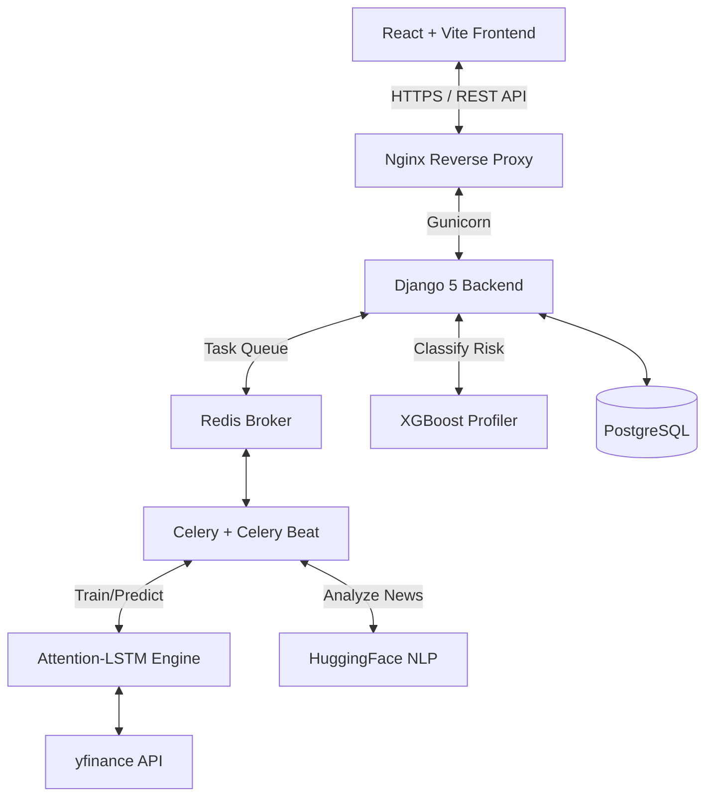
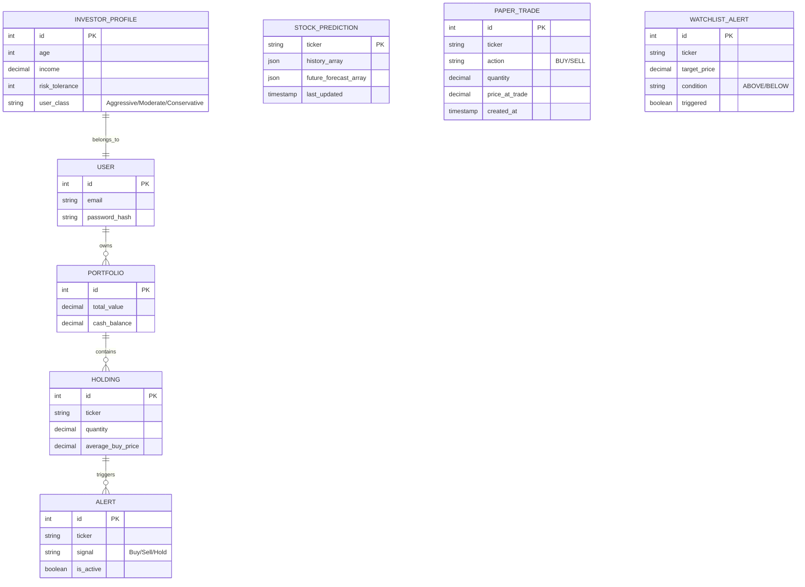

# 🚀 Cresta: Full-Stack AI Robo-Advisor

Cresta is a localized, full-stack AI-driven Robo-Advisory platform built specifically for the Indian equity market (NSE/BSE). Unlike standard retail brokerages that offer generic recommendations, Cresta acts as a personalized fiduciary—using institutional-grade Machine Learning to analyze stocks, predict price movements, and tailor recommendations to each user's specific financial goals and risk tolerance.

---

## 📊 Evaluation Metrics & Performance

### 1. 🧠 Intelligent Risk Profiling
Cresta dynamically classifies users as **Conservative, Moderate, or Aggressive** based on their Age, Income, Investment Goals, and Risk Tolerance.
* **Model:** XGBoost Classifier
* **Dataset:** 25,000 profiles — 2,578 real NFCS 2021 Investor Survey respondents (FINRA Foundation) augmented with 22,422 synthetic profiles generated via SEBI income capacity guideline distributions and empirical behavioral noise.
* **Accuracy:** 84% (5-Fold Stratified Cross-Validation)
* **Conservative Recall:** 84% — critical for fiduciary safety

**Explainable AI (XAI) - Feature Importance:**
| Feature | Importance |
|---|---|
| Risk Tolerance | 61.35% |
| Income | 17.81% |
| Investment Goal | 14.75% |
| Age | 3.88% |
| Experience | 2.21% |

### 2. 📈 Tier-2 Quant Stock Forecasting
Cresta features a highly advanced time-series prediction engine that forecasts stock prices 7 days into the future.
* **Architecture:** Attention-LSTM Hybrid + XGBoost + ARIMA Ensemble
The Attention mechanism applies learned temporal weights across LSTM hidden states, allowing the model to selectively focus on the most predictive time steps rather than treating all historical observations equally.
* **Ensemble weights:** (0.70 LSTM / 0.10 XGBoost / 0.20 ARIMA) selected via validation MAPE minimization across walk-forward folds — LSTM dominates long-horizon trend capture while ARIMA stabilizes short-term variance.
* **Features Used (16):** Close, Volume, SMA (5, 20), RSI (14), MACD, Bollinger Bands, OBV, FinBERT Sentiment (daily NSE-listed company headlines via yfinance news API, aggregated as mean sentiment score per ticker across all articles published within 24 hours), USD/INR Exchange Rate, India VIX, Crude Oil Futures
* **Validation:** Strict time-series Walk-Forward Validation (3-fold expanding window, minimum 45-day folds) to prevent look-ahead bias
* **Seed:** Fixed at 42 for full reproducibility
* **Dataset:** 20 years of historical Nifty50 daily data (via Kaggle & `yfinance`)

**Forecasting Performance (Walk-Forward Validated):**
| Ticker | Sector | Directional Accuracy | MAPE |
|---|---|---|---|
| RELIANCE.NS | Energy/Conglomerate | 85.2% | 10.84% |
| ICICIBANK.NS | Banking | 70.4% | 6.75% |
| HDFCBANK.NS | Banking | 72.6% | 7.01% |
| MARUTI.NS | Auto | 70.4% | 17.38% |
| ONGC.NS | Energy | 78.5% | 12.73% |
| TCS.NS | IT Services | 68.9% | 9.83% |
| SUNPHARMA.NS | Pharma | 60.7% | 5.98% |
| INFY.NS | IT Services | 54.1%* | 10.66% |

*Data-limited — insufficient 20-year historical coverage. System suppresses recommendations and serves data-limitation warning for stocks below 60% directional accuracy threshold.

**Average directional accuracy across 7 liquid stocks: 72.3%**

---

## 🏗️ System Architecture



### 🗄️ Database Schema


---

## ✨ Core Features

### 1. 🌍 Interactive 3D Global Exchange Globe
The landing page features an interactive 3D globe (powered by [cobe](https://github.com/shuding/cobe)) showcasing major global stock exchanges:
* **7 Global Exchanges:** BSE SENSEX, NSE NIFTY 50 (India), FTSE 100 (London), NYSE/DOW (New York), IBOVESPA (São Paulo), NIKKEI 225 (Tokyo), ASX 200 (Sydney)
* **Geographic Sync:** Angular-distance phi detection ensures the correct exchange card appears exactly when that continent faces the camera. India displays two cards (BSE + NSE); all other regions display one.
* **Emerald Pulse Connectors:** SVG dashed connector lines with emerald pulsing dots track from exchange cards to precise city coordinates on the globe surface
* **Theme-Aware:** Globe adapts palette for both Light and Dark mode via `ThemeContext`
* **Live Data:** BSE SENSEX and NSE NIFTY 50 prices fetched live from the backend API

### 2. 🎨 Premium Emerald Design System
Full Light/Dark theme support with a sophisticated **Emerald Green** (`#10B981`) accent palette:
* **Dark Mode Background:** Deep charcoal `#0d0d0d`
* **Light Mode Background:** Cool off-white `#f0f4f8`
* **Animated Hero Background:** Canvas-based breathing gradient with three independent radial emerald glows pulsing at different frequencies (1.5x, 1.0x, 0.7x), layered with 28 floating market data numbers (SENSEX values, ₹ prices, ▲▼ indicators, tickers) fading in and out — fully adapted for both dark and light modes
* **Complete cyan→emerald migration** across all components, Tailwind config, and CSS variables
* **Theme persistence** via `localStorage` with system preference detection

### 3. Explainable AI (XAI) & Fiduciary Scoring
Every stock is assessed on a personalized 100-point scale:
* **Sentiment (40 pts):** Financial news processed through FinBERT NLP
* **Risk Fit (40 pts):** Stock Beta matched against ML-classified user risk profile
* **Valuation (20 pts):** Price positioning relative to 52-week high/low
* Natural language reasoning generated for full fiduciary transparency

### 4. 📈 Global Dynamic Chart Coloring
Every chart across the application now features **dynamic green/red performance coloring** based on the overall price direction (Last Value vs First Value):
* **Portfolio Growth Chart:** Dynamically colors the main portfolio line based on current gains/losses.
* **Growth Forecast:** Historical line follows the trend direction; AI Forecast remains blue for visual distinction.
* **Market Watch Indices:** NIFTY, SENSEX, and BANK NIFTY area charts adapt their theme based on intraday performance.
* **Holdings Table Sparklines:** New "Trend" column featuring individual stock sparklines.
* **Globe Card Sparklines:** Exchange cards on the landing page now follow the global Emerald/Red theme.
* **Logic:** 🟢 Emerald green (`#10B981`) for profit/rise, 🔴 Red (`#ef4444`) for loss/dip. Both use a sleek `0.15` opacity fill.

### 5. 🛡️ Risk Assessment Persistence
The risk assessment flow is now fully synchronized with the backend:
* Results are persisted in the PostgreSQL database via `/profile/save/`.
* Logic prevents users from being redirected to the assessment on every login once completed.
* Professional-grade XGBoost classification based on NFCS behavioral surveys.

### 6. Comprehensive Portfolio Management
* Real-time tracking via `yfinance`
* Smart Buy/Sell/Hold alerts based on moving average crossovers
* Email alert integration via Django `send_mail`
* Paper trading and watchlist alert models

### 7. 🌐 Deep Localization (i18n)
Native `react-i18next` implementation supporting **English, Hindi, and Punjabi** across all UI components, ML reasoning strings, and alerts.

---

## 🛡️ Security

* **Authentication:** JWT with short-lived access tokens and HttpOnly refresh rotation
* **Computational DoS Mitigation:** /api/prediction serves from cached PostgreSQL arrays to prevent CPU exhaustion from repeated ML inference requests.
* **Input Sanitization:** Stock ticker inputs validated against NSE/BSE suffix whitelist
* **Production HTTPS:** `SECURE_SSL_REDIRECT`, `X-Frame-Options: DENY`, strict HSTS

---

## 🛠️ Technology Stack

**Frontend:** React 18, Vite, Tailwind CSS, Recharts, Framer Motion, i18next, Cobe
**Backend:** Django 5, DRF, PostgreSQL, Redis, Celery + Celery Beat
**ML:** PyTorch (Attention-LSTM), XGBoost, Scikit-Learn, HuggingFace FinBERT
**MLOps:** MLflow (CV loss curves, model versions, hyperparameters)
**DevOps:** Docker, Docker Compose, Nginx, Gunicorn

---

## ⚙️ ML Pipeline

1. **User Onboarding:** 4-step assessment → XGBoost risk classification
2. **Data Ingestion:** Celery Beat fetches EOD stock data and Nifty50 news headlines nightly
3. **Sentiment Analysis:** FinBERT generates sentiment score (−1 to 1) per stock
4. **Forecasting & Caching:** Predictions cached in PostgreSQL for 24 hours; sentiment cached in Redis with 24-hour TTL; fallback to nearest-neighbor proxy if cache miss
5. **Scoring:** Risk profile + Beta + Sentiment + Valuation → 0–100 Confidence Score with generated reasoning text

---

## 📚 Academic References

* Hochreiter, S., & Schmidhuber, J. (1997). Long Short-Term Memory. *Neural Computation*, 9(8), 1735–1780.
* Vaswani, A., et al. (2017). Attention Is All You Need. *NeurIPS*.
* Araci, D. (2019). FinBERT: Financial Sentiment Analysis with Pre-trained Language Models. *arXiv:1908.10063*.
* Chen, T., & Guestrin, C. (2016). XGBoost: A Scalable Tree Boosting System. *KDD '16*.
* Markowitz, H. (1952). Portfolio Selection. *Journal of Finance*, 7(1), 77–91.

---

## 🚀 Quick Start

### With Docker (Recommended)
```bash
git clone https://github.com/Cypher-redeye/Cresta.git
cd Cresta
docker-compose up --build
```
* Frontend: `http://localhost:5173`
* Backend API: `http://localhost:8000/api/`

### Without Docker
```bash
# Backend
cd backend
pip install -r requirements.txt
python manage.py migrate
python manage.py runserver

# Frontend
cd frontend
npm install
npm run dev
```

---

*Cresta is a production-ready, highly localized Robo-Advisory platform demonstrating the viable intersection of behavioral finance, deep learning, and modern web architecture.*
