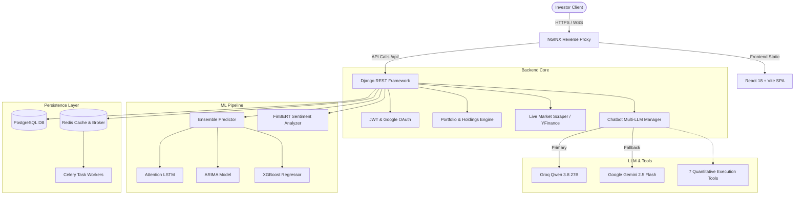
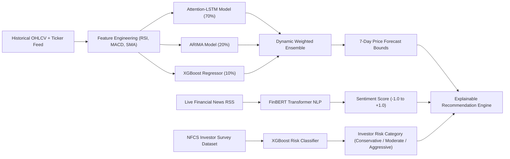
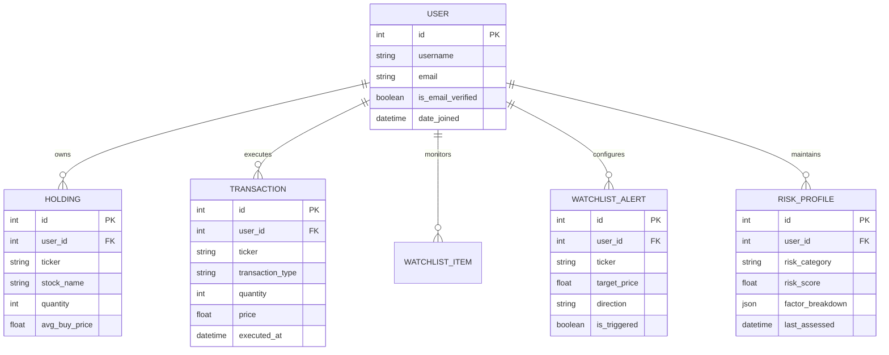

<div align="center">


# CRESTA
### Intelligent AI Robo-Advisory System for Indian Equity Markets

[](https://reactjs.org/)
[](https://djangoproject.com/)
[](https://pytorch.org/)
[](https://postgresql.org/)
[](https://redis.io/)
[](https://docker.com/)
[](LICENSE)

**[Live Platform](https://crestafinance.me)** · **[About the Team](#-founding-team)** · **[Architecture](#-system-architecture)** · **[Features](#-core-features)** · **[Installation](#-getting-started)**

</div>

---

## 📌 Executive Summary

**Cresta** is an open-source, production-grade AI robo-advisory platform engineered specifically for Indian retail and middle-class investors. 

### The Problem
Millions of middle-class individuals avoid the stock market because they perceive investing as equivalent to **gambling**, or are forced to rely on **expensive wealth managers and advisory firms** that charge heavy commissions for basic stock recommendations.

### The Cresta Solution
Cresta eliminates costly intermediaries by democratizing institutional-grade quantitative intelligence:
- **Zero Costly Intermediaries:** Automated quantitative models replace fee-heavy advisory firms.
- **Demystifying Volatility:** Clear, explainable AI scores (Sentiment, Valuation, Risk Fit) eliminate gambling fears.
- **Inclusive Accessibility:** Full multilingual support across **Hindi, Gujarati, Punjabi, and English**.
- **Real-Time Execution:** Multi-LLM financial agent with tool-calling capabilities that inspects holdings, generates forecasts, and executes backtests on the fly.

---

## 📸 Platform Showcase & Screenshots

<table width="100%">
  <tr>
    <td align="center" width="50%">
      
      <br /><sub><b>Dark Mode Landing</b> — Real-time NIFTY/SENSEX ticker, 3D interactive globe, and market summary.</sub>
    </td>
    <td align="center" width="50%">
      
      <br /><sub><b>Light Mode Landing</b> — High-contrast daylight view adapting palettes dynamically.</sub>
    </td>
  </tr>
  <tr>
    <td align="center" width="50%">
      
      <br /><sub><b>Portfolio Dashboard</b> — Real-time INR (₹) holdings valuation, P&L, allocation donut, and AI alerts.</sub>
    </td>
    <td align="center" width="50%">
      
      <br /><sub><b>Holdings & Signal Breakdown</b> — BUY/SELL/HOLD scoring based on Sentiment, Risk Fit, and Valuation.</sub>
    </td>
  </tr>
  <tr>
    <td align="center" width="50%">
      
      <br /><sub><b>Strategy Backtesting</b> — Historical simulations against the NIFTY 50 benchmark.</sub>
    </td>
    <td align="center" width="50%">
      
      <br /><sub><b>Backtest Analytics</b> — Sharpe ratio, maximum drawdown, CAGR, and equity curves.</sub>
    </td>
  </tr>
  <tr>
    <td align="center" width="50%">
      
      <br /><sub><b>Behavioral Risk Profiling</b> — Multi-phase questionnaire powered by an XGBoost classification model.</sub>
    </td>
    <td align="center" width="50%">
      
      <br /><sub><b>Market Watch & Forecasts</b> — 30-day historical quotes + 7-day walk-forward machine learning forecast.</sub>
    </td>
  </tr>
  <tr>
    <td align="center" width="50%">
      
      <br /><sub><b>Deep Regional Localization</b> — Complete Hindi interface support across analytics and reasoning.</sub>
    </td>
    <td align="center" width="50%">
      
      <br /><sub><b>FinBERT News Feed</b> — Financial sentiment scoring across recent stock headlines.</sub>
    </td>
  </tr>
</table>

---

## 🚀 Core Features

### 1. 🤖 Intelligent Conversational Co-Pilot (Multi-LLM Failover)
* **Hybrid Model Architecture:** High-speed **Groq (`qwen/qwen3.8-27b`)** primary engine (sub-0.3s response time) backed by **Google Gemini 2.5 Flash** fallback.
* **Autonomous Tool Calling:** The LLM actively invokes 7 live Python backend tools:
  * `get_portfolio(user_id)` — Queries live holdings, buy prices, and calculated unrealized P&L.
  * `get_forecast(ticker)` — Generates on-demand 7-day price bounds.
  * `get_market_data(ticker)` — Fetches live quotes for NSE equities and benchmark indices (`^NSEI`, `^BSESN`).
  * `run_backtest(ticker, period, capital)` — Backtests buy-and-hold strategies against historical data.
  * `get_news_sentiment(ticker)` — Analyzes news headlines using FinBERT.
  * `get_risk_profile(user_id)` — Inspects investor risk tier and behavioral factors.
  * `create_alert(ticker, price, direction)` — Sets price thresholds with automated triggers.
* **Direct Shortcut Integration:** Dedicated *"Ask AI"* button embedded directly within the Portfolio Allocation card.

### 2. 📊 Quantitative Machine Learning Stack
* **7-Day Price Forecast Ensemble:**
  * **Attention LSTM (70% weight):** Captures multi-day temporal sequence dependencies.
  * **ARIMA (20% weight):** Accounts for linear trend lines and mean reversion.
  * **XGBoost (10% weight):** Ingests technical momentum indicators (RSI, MACD, Bollinger Bands).
* **FinBERT Sentiment Analysis:** Pre-trained NLP model analyzes live headlines from Reuters, Economic Times, and Yahoo Finance, scoring sentiment from `-1.0` (Bearish) to `+1.0` (Bullish).
* **Behavioral Risk Profiler:** XGBoost classifier trained on real investor survey datasets to assign Conservative, Moderate, or Aggressive profiles with dynamic reassessment scheduling.

### 3. 🧪 Historical Backtesting Engine
* Simulates capital growth over 6-month, 1-year, and 2-year periods against the **NIFTY 50** index.
* Computes institutional-grade risk metrics:
  * **Sharpe Ratio** (risk-adjusted return)
  * **Maximum Drawdown (MDD)** (peak-to-trough capital loss)
  * **Compound Annual Growth Rate (CAGR)**
  * **Win/Loss Volatility Curves**

### 4. 💼 Portfolio Management & Allocation Sandbox
* Live tracking of Indian stocks (NSE/BSE) with daily P&L and invested values formatted in **INR (₹)**.
* **What-If Sandbox Mode:** Interactive sliders let investors simulate rebalanced portfolio distributions without affecting actual capital.

### 5. 🛡️ Security & Enterprise Auth
* **HttpOnly JWT Cookie Rotation:** Access tokens stored securely in memory with automated silent refresh on token expiration.
* **CSRF Double-Submit Protection:** Strict origin verification across all mutating endpoints.
* **Google OAuth 2.0 & Email Verification:** Token-based activation flow with 24-hour validity windows.

---

## 🏗️ System Architectures

### 1. High-Level Infrastructure & Request Flow


### 2. Quantitative Machine Learning & Sentiment Pipeline


### 3. Database Entity-Relationship (ER) Schema


---

## 📂 Team & Repository Structure

The codebase is organized into **4 independent core modules**, allowing each team lead to develop, test, and commit autonomously:

```
Cresta/
├── frontend/               # 🎨 Om Sharma (Frontend Lead)
│   ├── src/                # React 18, Tailwind, Framer Motion, i18n
│   ├── public/             # Branding assets, SVGs, favicon
│   └── package.json
│
├── backend/                # 🛠️ Ankit Mishra (Team Leader & Backend Lead)
│   ├── advisor/            # Authentication, Portfolio, Market APIs
│   ├── robo_advisor/       # Django settings, WSGI/ASGI, URLs
│   ├── Dockerfile
│   └── manage.py
│
├── ml_model/               # 🧠 Shivam Panchal (Machine Learning Lead)
│   ├── recommender/        # Attention-LSTM, ARIMA, XGBoost ensemble
│   ├── backtest.py         # Strategy backtesting runner
│   ├── calc_accuracy.py    # Walk-forward accuracy validator
│   └── README.md
│
├── chatbot/                # 🤖 Shubham Jha (Chatbot & NLP Lead)
│   ├── views.py            # Multi-LLM failover (Groq + Gemini), SSE streaming
│   ├── tools.py            # 7 autonomous LangChain financial execution tools
│   ├── prompts.py          # Multilingual system prompts (EN/HI)
│   ├── memory.py           # Conversation history manager
│   └── README.md
│
├── docs/screenshots/       # 📸 Visual platform walkthroughs
└── docker-compose.yml      # 🐳 Multi-container orchestration
```

---

## 👥 Founding Team

Developed at **Parul University, Vadodara, Gujarat**:

<div align="center">

| [<br /><b>Ankit Mishra</b>](https://github.com/ankitrmishra01) | [<br /><b>Om Sharma</b>](https://github.com/Cypher-redeye) | [<br /><b>Shivam Panchal</b>](https://github.com/Shivam-Panchal0210) | [<br /><b>Shubham Jha</b>](https://github.com/account) |
| :---: | :---: | :---: | :---: |
| **Team Leader**<br />*Backend & Integration Lead* | **Frontend Lead**<br />*UI/UX & Architecture* | **ML Lead**<br />*Quant & Model Ensembles* | **Chatbot Lead**<br />*NLP & Conversational AI* |
| [](https://www.linkedin.com/in/ankitrmishra01) | [](https://www.linkedin.com/in/om-sharma38) | [](https://www.linkedin.com/in/shivam-panchal-7471052a5) | [](https://www.linkedin.com/in/shubham-jha-986520312) |

</div>

---

## ⚙️ Tech Stack

| Domain | Technologies |
|---|---|
| **Frontend** | React 18, Vite, Tailwind CSS, Framer Motion, Lucide Icons, Recharts, Lenis Smooth Scroll, i18next |
| **Backend** | Python 3.12, Django 5.x, Django REST Framework, SimpleJWT, Celery, Redis |
| **AI / LLMs** | LangChain, Groq (`qwen/qwen3.8-27b`), Google GenAI (`gemini-2.5-flash`), Tool Calling |
| **Machine Learning** | PyTorch, XGBoost, Statsmodels (ARIMA), Transformers (ProsusAI FinBERT), Scikit-Learn |
| **Database & Cache** | PostgreSQL 16, Redis 7 (caching, celery broker & throttle tracking) |
| **Infrastructure** | Docker, Docker Compose, NGINX Reverse Proxy, Linux Alpine |

---

## 🛠️ Getting Started

### Prerequisites
* [Docker Desktop](https://www.docker.com/products/docker-desktop/) (Docker 24+, Docker Compose v2)
* Node.js 18+ (for local frontend development)
* Python 3.12+ (for local backend development)

### Quick Start (Dockerized)

1. **Clone the repository:**
   ```bash
   git clone https://github.com/ankitrmishra01/Cresta1.git
   cd Cresta1
   ```

2. **Configure environment variables:**
   Create `.env` in the root folder:
   ```env
   SECRET_KEY=your-super-secret-django-key
   DEBUG=True
   ALLOWED_HOSTS=localhost,127.0.0.1,0.0.0.0
   CORS_ALLOWED_ORIGINS=http://localhost:5173,http://localhost:3000

   # Database & Redis
   DATABASE_URL=postgres://postgres:postgres@db:5432/cresta_db
   REDIS_URL=redis://redis:6379/0

   # AI LLM Keys
   GROQ_API_KEY=your-groq-api-key
   GEMINI_API_KEY=your-gemini-api-key

   # SMTP Email Verification
   EMAIL_HOST_USER=your-email@gmail.com
   EMAIL_HOST_PASSWORD=your-app-password
   ```

3. **Launch the platform:**
   ```bash
   docker compose up --build -d
   ```

4. **Verify running containers:**
   ```bash
   docker ps
   ```
   * `cresta-backend-1`: `http://localhost:8000`
   * `cresta-frontend-1`: `http://localhost:80` (or `http://localhost:5173` if running Vite locally)
   * `cresta-db-1`: PostgreSQL port `5432`
   * `cresta-redis-1`: Redis port `6379`
   * `cresta-celery_worker-1`: Celery background tasks

---

## 📡 API Overview

| Endpoint | Method | Description |
|---|---|---|
| `/api/auth/google/` | `POST` | Google OAuth token exchange & user sync |
| `/api/auth/token/` | `POST` | User login & JWT issuance |
| `/api/auth/refresh/` | `POST` | Silent JWT access token refresh |
| `/api/profile/save/` | `POST` | Persist risk questionnaire scores |
| `/api/recommend/` | `POST` | Generate XGBoost + FinBERT stock suggestions |
| `/api/chat/` | `POST` | Real-time SSE streaming conversational AI |
| `/api/market-status/` | `GET` | Live NIFTY, SENSEX, USD/INR, and Gold rates |
| `/api/holdings/` | `GET/POST` | Fetch or add portfolio stock entries |
| `/api/backtest/` | `POST` | Execute quantitative historical backtest |

---

## 📄 License & Academic Disclaimer

Distributed under the **MIT License**. See `LICENSE` for more information.

*Disclaimer: Cresta is an academic engineering project developed at Parul University for educational, research, and simulation purposes. Cresta is not a SEBI-registered investment advisor.*
