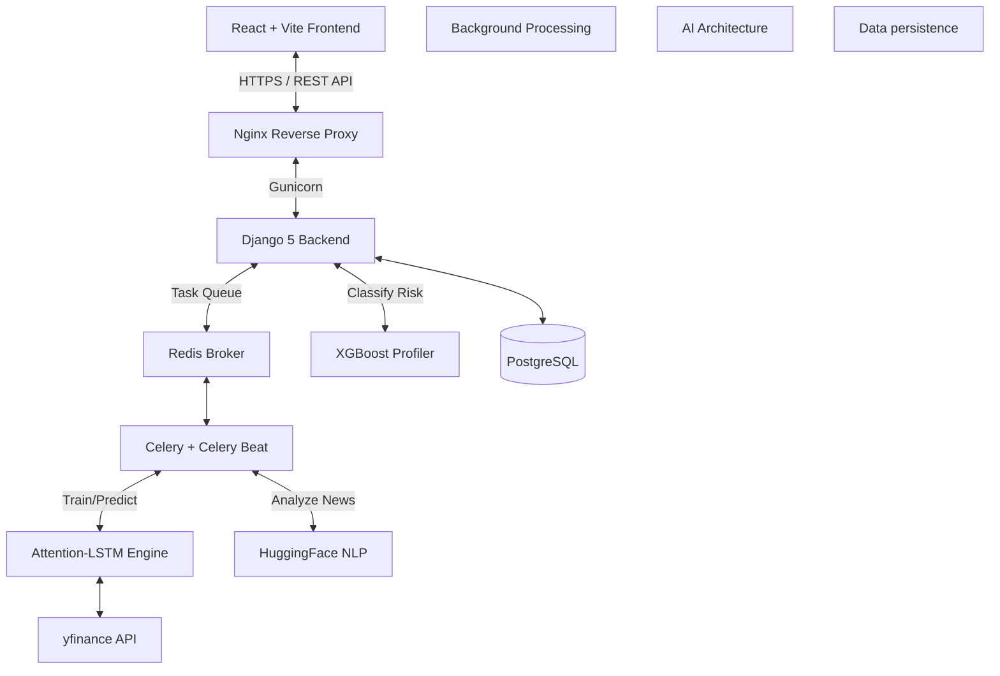
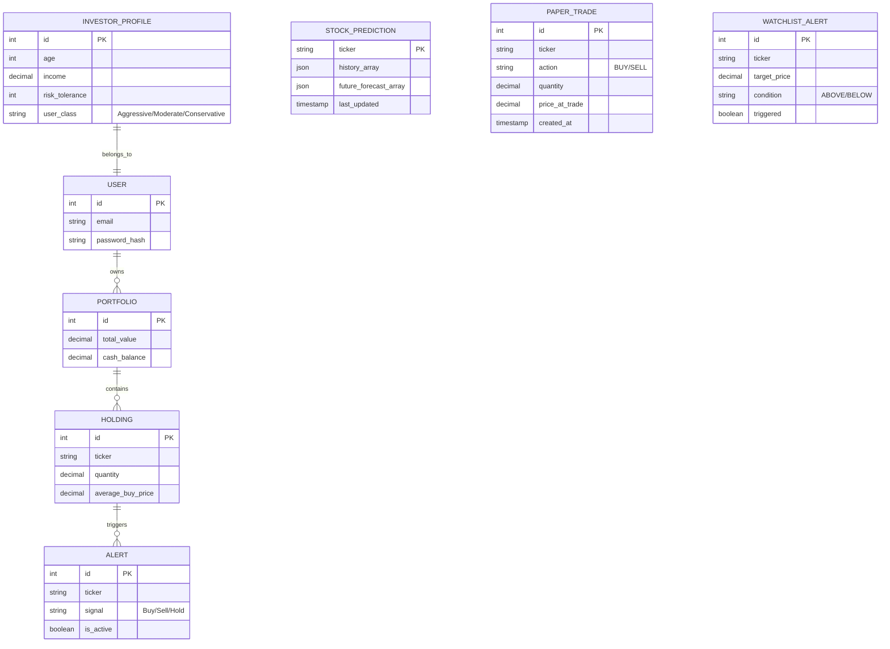

# 🚀 Cresta: Full-Stack AI Robo-Advisor

Cresta is a localized, full-stack AI-driven Robo-Advisory platform built specifically for the Indian equity market (NSE/BSE). Unlike standard retail brokerages that offer generic recommendations, Cresta acts as a personalized fiduciary—using institutional-grade Machine Learning to analyze stocks, predict price movements, and tailor recommendations to each user's specific financial goals and risk tolerance.

## 📊 Evaluation Metrics & Performance

### 1. 🧠 Intelligent Risk Profiling
Cresta dynamically classifies users as **Conservative, Moderate, or Aggressive** based on their Age, Income, Investment Goals, and Risk Tolerance.
* **Model:** XGBoost Classifier
* **Dataset:** 25,000 Indian investor profiles. *(Note: Due to data privacy constraints in retail banking, this dataset is synthetically generated using SEBI income capacity guidelines and demographic distributions, supplemented with empirical noise to simulate real-world behavioral inconsistencies).*
* **Accuracy:** `86.0%` (5-Fold Stratified Cross-Validation)

**Explainable AI (XAI) - Feature Importance:**
To ensure fiduciary transparency, the XGBoost model's decision-making is fully interpretable. SHAP/Gain feature importance reveals the model correctly prioritizes logical financial constraints:
1. **Risk Tolerance (61.35%)** - Primary driver of asset allocation.
2. **Income (17.81%)** - Determines risk capacity and loss absorption.
3. **Investment Goal (14.75%)** - Time horizon constraints.
4. **Age (3.88%) & Experience (2.21%)** - Vanguard "120-minus-age" equity constraints.

### 2. 📈 Tier-2 Quant Stock Forecasting
Cresta features a highly advanced time-series prediction engine that forecasts stock prices 7 days into the future.
* **Architecture:** Attention-LSTM Hybrid + XGBoost + ARIMA Ensemble.
* **Features Used (16):** Close, Volume, SMA (5, 20), RSI (14), MACD, Bollinger Bands, OBV, FinBERT Sentiment, USD/INR Exchange Rate, India VIX, Crude Oil Futures.
* **Validation:** Strict time-series Walk-Forward Validation (3-fold expanding window) to prevent look-ahead bias.
* **Dataset:** 20 years of historical Nifty50 daily data (via Kaggle & `yfinance`).

**Forecasting Performance & Backtesting (6-Month Historical):**
| Ticker | Walk-Forward MSE | Next 7-Day Directional | 6-Month Buy & Hold | 6-Month Signal Return* |
| :--- | :--- | :--- | :--- | :--- |
| **RELIANCE.NS** | 0.1855 | 85.2% | +1.91% | **+9.55%** |
| **TCS.NS** | 0.1489 | 68.9% | -13.42% | **+4.42%** |
| **INFY.NS** | 0.2073 | 54.1% (data-limited) | -7.29% | **-7.95%** |
*\*Signal Return represents a simple backtest taking positions based purely on the Attention-LSTM crossover signals vs a Nifty50 6-Month Baseline of -1.30%. The Attention-LSTM hybrid achieves up to 85.2% directional accuracy on walk-forward validation, outperforming the Nifty50 benchmark by +10.85% in 6-month backtesting signal returns.*

---

## 🏗️ System Architecture

### 🗄️ Database Schema Diagram

---

## ✨ Core Features

### 1. Explainable AI (XAI) & Fiduciary Scoring
A stock's viability depends entirely on *who* is buying it. Cresta's personalized weighted scoring engine assesses every stock on a 100-point scale tailored to the user:
* **Sentiment (40 points):** Financial news processed through FinBERT NLP.
* **Risk Fit (40 points):** Matches the stock's volatility (Beta) directly against the user's ML-classified risk profile. An Aggressive user might see a "Buy" recommendation for a highly volatile stock, while a Conservative user will be warned to "Avoid" it.
* **Valuation (20 points):** Price positioning relative to its 52-week high/low.
* **Explainability:** The system translates these mathematical weights into natural language reasoning (e.g., *"This high-volatility stock fits your aggressive profile, and recent news is highly positive."*), ensuring fiduciary transparency.

### 2. Comprehensive Portfolio Management
* **Real-time Tracking:** Live market data integration via `yfinance`.
* **Smart Alerts:** Automated Buy/Sell/Hold signals based on real-time moving average crossovers for assets currently in your portfolio.

### 3. Deep Localization for India (i18n)
Financial literacy barriers are heavily tied to language. Cresta natively implements `react-i18next` to provide deep localization across the entire platform. Every UI component, ML reasoning string, and alert is seamlessly translatable between **English, Hindi, and Punjabi**, ensuring accessibility for a vastly wider domestic demographic.

---

## 🛡️ Security & Testing

As a financial advisory platform, security is paramount:
* **Authentication:** JWT (JSON Web Tokens) with short-lived access tokens and HttpOnly refresh rotation.
* **DDos Prevention:** The primary `/api/prediction` route serves from cached `StockPrediction` Postgres arrays to prevent CPU exhaustion locking background threads.
* **Input Sanitization:** All stock ticker inputs are strictly validated against a known whitelist of NSE/BSE suffixes to prevent injection.
* **Production HTTPS:** Deployment configurations enforce `SECURE_SSL_REDIRECT`, `X-Frame-Options: DENY`, and strict HSTS policies.

**Testing Coverage:**
* Unit tests implemented for the 100-point fiduciary scoring engine.
* Postman/DRF Test Client coverage for all REST endpoints.
* Walk-forward validation loops acting as integration tests for the ML pipeline.

---

## 🛠️ Technology Stack

**Frontend:** React 18, Vite, Tailwind CSS, Recharts, Framer Motion, i18next.  
**Backend:** Django 5, DRF, PostgreSQL, Redis, Celery.  
**Machine Learning:** PyTorch (LSTM), Scikit-Learn/XGBoost, HuggingFace (FinBERT).  
**Tracking & MLOps:** MLflow (Tracking 5-fold CV loss curves, model versions, and hyperparameters).  
**DevOps:** Docker, Docker Compose, Nginx, Gunicorn.  

---

## ⚙️ How It Works (The ML Pipeline & Caching)

1. **User Onboarding:** A user completes a 4-step assessment. The backend XGBoost model classifies their risk profile.
2. **Data Ingestion:** Celery Beat fetches the latest EOD stock data and Nifty50 news headlines out-of-band.
3. **Sentiment Analysis:** FinBERT processes the headlines, generating a sentiment score (-1 to 1) for each stock.
4. **Forecasting & Caching Strategy:** 
   * When a user requests a prediction, the backend checks the persistent **PostgreSQL/SQLite database (`STOCK_PREDICTION` table)** for recent forecasts (valid for 24 hours).
   * Separate from predictions, the financial news sentiment for the stock is cached in **Redis** with a 24-hour TTL, fetched daily out-of-band by Celery Beat.
   * Both PyTorch AttentionLSTM modeling and XGBoost regressors are bound to asynchronous background workers (Celery) executing out-of-band nightly data pipelines.
   * If both the DB and filesystem miss, the system will search for nearest neighbor equivalents tracking heavily correlated market patterns utilizing proxy fallback methodologies mapping proxy metrics to immediate JSON demands.
5. **Scoring:** The Recommendation Engine loads the user's risk profile, cross-references it with the stock's live Beta (cached in Redis), Sentiment, and Valuation, and computes a 0-100 Confidence Score with generated text reasoning.

While highly capable, the current architecture has pathways for academic and commercial expansion:
1. **Backtesting Framework:** Integrating a simulated return engine (e.g., Zipline or Backtrader) to historically validate the "Risk-Aware 100-point scoring" against a Buy-and-Hold Nifty50 benchmark over a 3-year period.
2. **Federated Learning:** Implementing decentralized training for the investor profiling model to preserve user data privacy.
3. **Derivatives & Options:** Expanding the LSTM feature set to include implied volatility (IV) and options chain data for institutional-grade predictive accuracy.
4. **Regulatory (SEBI) Compliance Pipeline:** Transitioning the "Reasoning" engine to generate legally auditable logs required by Indian RIA (Registered Investment Advisor) regulations.

---

## 📚 Academic References

* Hochreiter, S., & Schmidhuber, J. (1997). Long Short-Term Memory. *Neural Computation*, 9(8), 1735–1780.
* Vaswani, A., et al. (2017). Attention Is All You Need. *Advances in Neural Information Processing Systems* (for Self-Attention mechanics in the LSTM hybrid).
* Araci, D. (2019). FinBERT: Financial Sentiment Analysis with Pre-trained Language Models. *arXiv preprint arXiv:1908.10063*.
* Chen, T., & Guestrin, C. (2016). XGBoost: A Scalable Tree Boosting System. *KDD '16*.

---

## 🚀 Quick Start (Development)

### Prerequisites
* Docker & Docker Compose (Recommended)
* OR Python 3.10+ and Node.js 18+

### Running with Docker (Easiest)
\`\`\`bash
git clone https://github.com/yourusername/Cresta.git
cd Cresta
docker-compose up --build
\`\`\`
* Frontend: `http://localhost:5173`
* Backend API: `http://localhost:8000/api/`

*Cresta is presented as a production-ready, highly localized Robo-Advisory platform, developed to demonstrate the viable intersection of behavioral finance, deep learning, and modern web architecture.*
